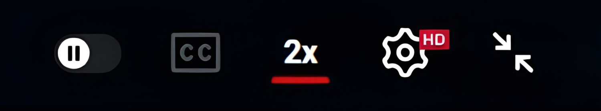

# ⚡ Double Speed Toggle for YouTube


A lightweight Chrome extension that adds a one-click **2x speed button** directly inside the YouTube player — no menus, no steps, no frustration.

---

## 📸 Preview



---

## 😤 Why I Built This

Let's be real — as students, we all watch lectures, tutorials, and recorded classes at 2x speed. But every single time you open a video, getting to 2x looks like this:

1. Click the **Settings (⚙️)** icon
2. Click **Playback speed**
3. Click **2**
4. Hit the **Back (←)** button
5. Click **Settings (⚙️) again** just to close the panel

That's **5 steps. Every. Single. Video.**

I got tired of it. So I built this.

Now it's just **one click** — a `2x` button sitting right there in the player controls, always visible, always ready.

---

## ✨ Features

- **One-click 2x toggle** — press once to enable, press again to go back to 1x
- **Visual indicator** — a red underline appears on the button when 2x is active
- **Persistent across videos** — speed preference carries over as you navigate between videos
- **Zero permissions required** — the extension doesn't ask for access to anything

---

## 🚀 Installation (Load Unpacked)

> Chrome Web Store submission coming soon. For now, install manually in under a minute:

1. Clone or download this repository
   ```bash
   git clone https://github.com/satyamkumar0401/double-speed-toggle-for-youtube.git
   ```
2. Open Chrome and go to `chrome://extensions/`
3. Enable **Developer mode** (toggle in the top-right corner)
4. Click **Load unpacked**
5. Select the `Youtube 2x Button` folder

Done. Open any YouTube video and look for the `2x` button in the player.

---

## 📁 Project Structure

```
double-speed-toggle-for-youtube/
│
├── Youtube 2x Button/        # Extension source
│   ├── icons/                # Extension icons
│   │   ├── icon16.png
│   │   ├── icon32.png
│   │   ├── icon48.png
│   │   └── icon128.png
│   ├── content.js            # Injects button & manages speed logic
│   ├── manifest.json         # Extension config (Manifest V3)
│   └── styles.css            # Button styling
│
├── screenshots/              # Preview images
│   └── youtube-page.png
│
├── .gitignore
├── LICENSE
└── README.md
```

---

## 🛠️ How It Works

The extension injects a button into YouTube's native player controls using a content script. When clicked, it sets `video.playbackRate = 2.0` and uses a `MutationObserver` to watch for YouTube's SPA navigation — so the button re-appears and your speed preference is remembered as you move between videos.

---

## 🤝 Contributing

Found a bug? Have an idea? Feel free to open an issue or submit a pull request. All contributions are welcome.

---

## 👤 Author

**Satyam Kumar** — [@satyamkumar0401](https://github.com/satyamkumar0401)

---

## 📄 License

This project is licensed under the [MIT License](LICENSE).
